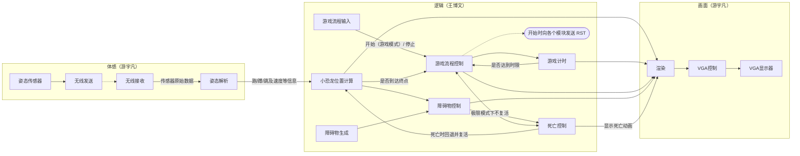
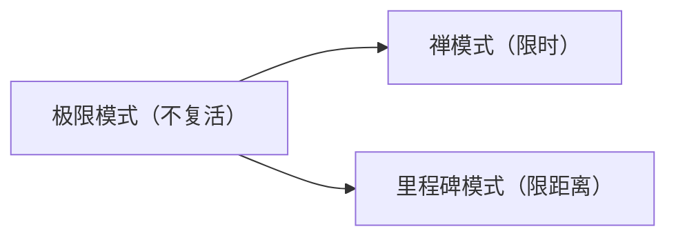

# 数字逻辑设计

第 12 组 · 游宇凡 @ouuan · 王博文 @abmfy

---

## 模块划分

```mermaid
flowchart LR

subgraph "体感（游宇凡）"

姿态传感器 --> 无线发送 -.-> 无线接收 -- 传感器原始数据 --> 姿态解析

end

subgraph "逻辑（王博文）"

姿态解析 -- 跑/蹲/跳及速度等信息 --> 小恐龙位置计算 --> 障碍物控制

障碍物生成 --> 障碍物控制 --> 死亡控制 -- 死亡时回退并复活 --> 小恐龙位置计算

游戏流程输入 -- "开始（游戏模式）/ 停止" --> 游戏流程控制 -.-> broadcast(["开始时向各个模块发送 RST"])

小恐龙位置计算 -- 是否到达终点 --> 游戏流程控制 --> 游戏计时

游戏计时 -- 是否达到时限 --> 游戏流程控制

游戏流程控制 <-- 极限模式下不复活 --> 死亡控制

end

subgraph "画面（游宇凡）"

小恐龙位置计算 & 游戏计时 & 游戏流程控制 & 障碍物控制 --> 渲染

死亡控制 -- 显示死亡动画 --> 渲染

渲染 --> VGA控制 --> VGA显示器

end
```

### 阶段目标

```mermaid
flowchart LR

extreme["极限模式（不复活）"] --> zen["禅模式（限时）"] & classic["里程碑模式（限距离）"]
```
