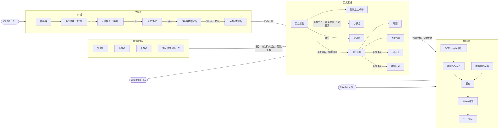
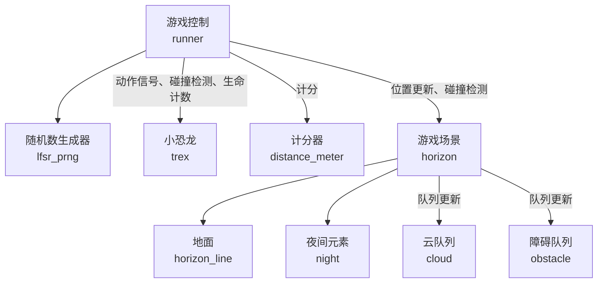
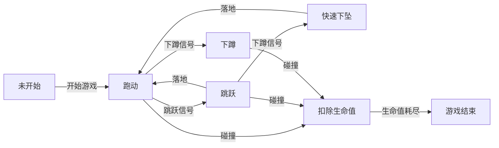

<style>
h2 {
    margin-bottom: 0.5rem !important;
}

#slideshow {
    background-position: center;
    background-size: cover;
    background-image: linear-gradient(#fffe, #fffd), url('/dino.webp');
}
</style>

<!-- Neta 健身环大冒险 -->
# 数设项目展示：<ruby>小恐龙大冒险<rt><del>Ring</del> Dino Fit Adventure</rt>！</ruby>

游宇凡 @ouuan · 王博文 @abmfy · 2023.6.6

---
layout: center
---

# 灵感来源

- Chrome 在未联网情况下访问网站会出现小恐龙彩蛋
- 能不能让“跳跃”变成真正的跳跃呢？
- 将小恐龙与 FPGA 结合，让玩家在获得快乐的同时也能达到健身效果

---
layout: center
---

# 项目成果

-   基本完整复刻了原版 Chrome 小恐龙的所有元素
-   画面分辨率 1280×800 @ 60Hz（实际画面大小 1280×300）
-   支持按键输入和传感器输入两种输入方式
-   传感器输入：通过绑在大腿上的传感器检测玩家跳跃和下蹲的动作（~~可以用来健身~~）
-   使用传感器时游戏难度较高，提供多条生命作为补偿
-   画面流畅，反应灵敏（使用按键时），试玩时轻松达到了电脑上个人纪录的两倍（11554 分）

---

# 整体设计简述

<span/>

整体设计分为三大部分：传感器、游戏逻辑、画面输出。

游宇凡负责传感器和画面输出两部分，王博文负责游戏逻辑。

我们之间的接口非常简单，只有起跳、下蹲的信号，画面上每个元素的坐标信息，控制昼夜转换的信号，以及画面刷新信号、时钟信号等，大大降低了沟通成本。



---
layout: center
---
# *现场展示*

---

# 游戏逻辑

<span/>



---
clicks: 4
---

# 游戏逻辑 —— 跳跃/下蹲

<v-clicks>

- 实数的运算需要大量的时钟周期
- 通过额外的进制计数器来模拟定点数运算
- 通过状态机控制小恐龙运动状态
- 跳跃力度不同，跳跃高度也不同

</v-clicks>

<v-click at="2">



</v-click>

---
clicks: 4
---

# 游戏逻辑 —— 障碍生成

<v-clicks>

- 不能像软件代码一样拥有真正可变长的序列
- 维护了一个数组模拟的循环队列来管理障碍物
- 满足障碍生成条件时，从 7 种障碍物中随机生成并加入队列
- 当障碍从视野中消失时，移出队列

</v-clicks>


<v-click at="1">


</v-click>


---

# 游戏逻辑 —— 障碍生成

<v-clicks>

- 障碍物的间隔根据障碍物的类型、当前游戏速度随机生成
- 问题：需要模运算，单周期内无法完成
- 解决：利用流水线除法器 IP 核多周期运算
- 通过状态机依次完成所有元素的更新

</v-clicks>

<v-click>


</v-click>

---
clicks: 4
---

# 游戏逻辑 —— 碰撞检测

<v-clicks>

- 使用 AABB (Axis-Aligned Border Box) 可能造成误判
- 检验像素是否重合时间开销过大
- 拆分为多个子碰撞箱进行碰撞检测
- 由于硬件天然的并行特性，可以同时检测多个碰撞箱而不带来额外性能开销

</v-clicks>

<div style="display: flex; align: center">
    
    
</div>

---

# 游戏逻辑 —— 统一交互接口

<v-clicks>

- 逻辑模块内部使用统一的接口进行信号更新、碰撞检测、速度更新等操作
- 对显示模块提供统一的接口，输出元素坐标、元素材质、昼夜切换信号
- 框架建成后，增加新功能非常敏捷

</v-clicks>

<v-click>

```verilog
output sprite_t     sprite     [RENDER_SLOTS],
output pos_t        pos        [RENDER_SLOTS],
output night_rate_t night_rate
```

</v-click>

---
layout: two-cols
---

# 游戏逻辑 —— 其他小细节

<v-click>

- 地面看起来是完整的，但其实是两块拼起来的
    - 一块移出屏幕左侧之后就会瞬移到屏幕另一边
    - 有两种地面 (平整/崎岖)，随机出现

</v-click>
<v-click>

- 月亮有月相变化
    - 每次新的夜晚到来的时候月亮都会变圆一些
    - 直到满月之后再逐渐变瘦

</v-click>
<v-click>

- 随机数种子除了由实验板上拨码开关设定，还取决于开始游戏的那次起跳的时间
    - 每一局都不一样！

</v-click>
<v-click>

- 各种想得到和想不到的坑

</v-click>

::right::

<v-click>


</v-click>

---
layout: two-cols
clicks: 5
---

# 运动检测

<template v-slot:right>

<v-click at="0">


</v-click>

</template>

<v-clicks>

- 6 页的 paper，完整地介绍了用深度学习方法实现跳跃的检测
- 我们有没有可能根据这篇论文，让这个了不起的发明在 FPGA 上重见天日？
- 终于，~~在我们小组齐心协力、孜孜不倦、废寝忘食地研究了一个月后...~~
- 我们放弃了，它太复杂了
- 不过，我们努力用基本的牛顿力学原理重现了它的神韵...

</v-clicks>

---
layout: image-right
image: /sensor.jpg
---

<style scoped>
* {
    font-size: 0.95rem;
}
</style>

# 传感器

<span/>

<v-click>

传感器焊接后固定在面包板上，放在为健身环设计的绑腿里，由充电宝供电，通过无线模块连接到实验板，采用 UART 协议通信，得到加速度、角度等原始数据。

-   外设的供电：纽扣电池电流不足改成充电宝供电（难点在于发现问题出在电流不足）
-   外设的连接：焊接排针 → 透明胶绑定 → 焊<span class="absolute">接所有连线</span> <!-- hack 一下排版 -->

</v-click>

<v-click>

下蹲：很简单，和水平方向夹角够小就认为蹲下了。（抬腿太高会被误判，但正常玩的时候不误判即可。）

起跳：竖直方向上含 $g$ 的加速度（向上为正）大于 $-0.25g$ 就认为是在跳，这实际上是在检测玩家处于腾空状态（~~回忆一些初中物理~~）。尝试了各种花里胡哨的检测方法，效果都不如简单的阈值检测。由于灵敏度、延迟之类的问题，使用传感器时游戏难度较高，需要提供多条生命作为补偿。

</v-click>

---

# 画面输出

<span/>

<v-click>

画面输出采用双显存 + ring buffer，元素绘制基于原版游戏使用的 sprite 图（略有修改），压缩至只有 8 种颜色并裁剪掉不需要的部分从而能放进片内 RAM 而不损失分辨率。将画面背景和元素逐个写入显存，每个元素就是 sprite 中的一个区域。

</v-click>

<v-click>

难点：时序设计

-   设计时钟频率（VGA 需要 83.46MHz 的高频时钟，很多计算难以完成；写入/读取显存采用不同的时钟）
-   处理信号跨域
-   处理耗时长的计算（计算昼夜渐变时采用打表而不是乘法）
-   修复 buffer / RAM 等导致的时钟周期偏移

</v-click>
