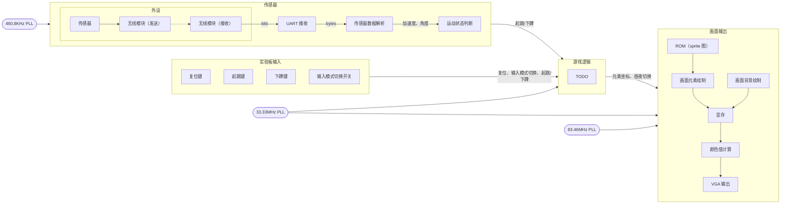

# 数设项目展示：Chrome 小恐龙

游宇凡 @ouuan · 王博文 @abmfy · 2023.6.6

---
layout: center
---

# 项目成果

-   基本完整复刻了原版 Chrome 小恐龙的所有元素
-   画面分辨率 1280×800 @ 60Hz（实际画面大小 1280×300）
-   支持按键输入和传感器输入两种输入方式
-   传感器输入：通过绑在大腿上的传感器检测玩家跳跃和下蹲的动作（~~可以用来健身~~）
-   使用传感器时游戏难度较高，提供多条生命作为补偿
-   画面流畅，反应灵敏（使用按键时），试玩时轻松达到了电脑上个人纪录的两倍（11554 分）

---

# 整体设计简述

整体设计分为三大部分：传感器、游戏逻辑、画面输出。

游宇凡负责传感器和画面输出两部分，王博文负责游戏逻辑。

我们之间的接口非常简单，只有起跳、下蹲的信号，画面上每个元素的坐标信息，控制昼夜转换的信号，以及画面刷新信号、时钟信号等，大大降低了沟通成本。

---

# 游戏逻辑 & 现场展示

---

# 传感器 & 画面输出

<v-click>

传感器焊接后固定在面包板上，由充电宝供电，通过无线模块连接到实验板，采用 UART 协议通信，得到加速度、角度等原始数据，由此判断玩家是否起跳/下蹲。

坑：

-   外设的供电：纽扣电池电流不足改成充电宝供电（难点在于发现问题出在电流不足）
-   外设的连接：焊接排针 → 透明胶绑定 → 焊接所有连线
-   传感器跳跃检测：各种花里胡哨的检测方法都不如最简陋的方法，游戏难度过高，需要提供多条生命作为补偿

</v-click>

<v-click>

画面输出采用双显存 + ring buffer，元素绘制基于原版游戏使用的 sprite 图（略有修改），压缩至只有 8 种颜色并裁剪掉不需要的部分从而能放进片内 RAM 而不损失分辨率。逐个绘制画面背景和每个元素，每个元素就是 sprite 中的一个区域。

难点：设计时钟频率，处理耗时长的计算，处理跨域信号，修复 buffer / RAM 导致的时钟周期偏移。

</v-click>
